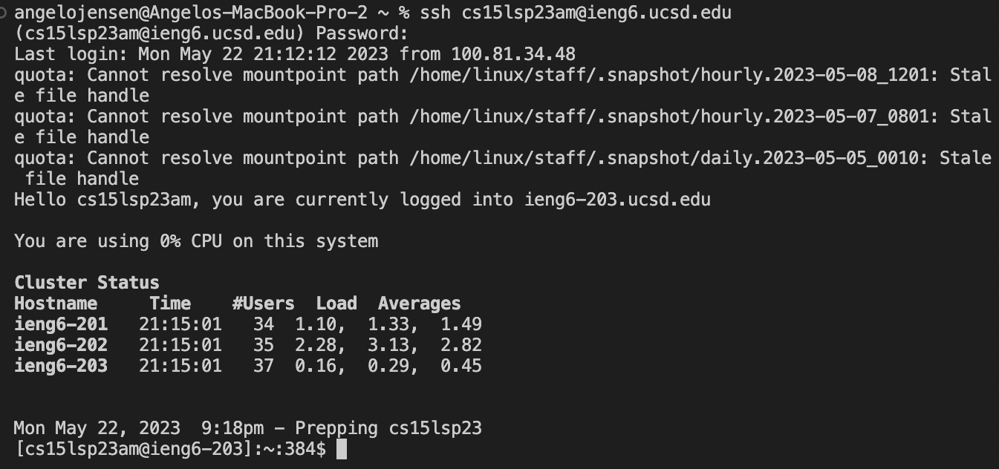
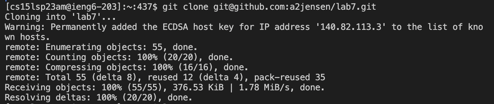
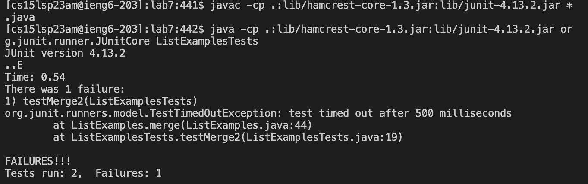
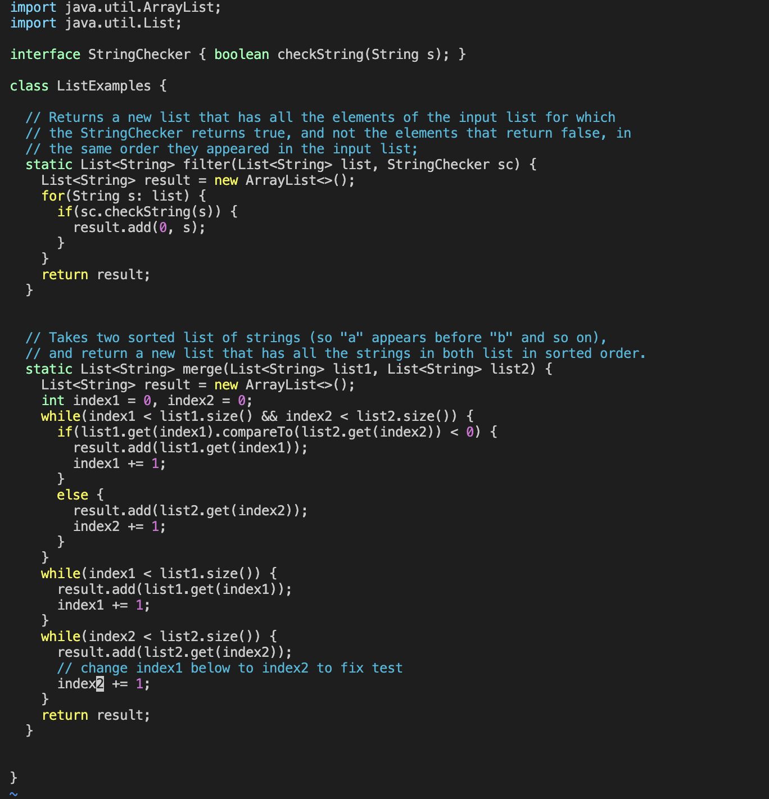
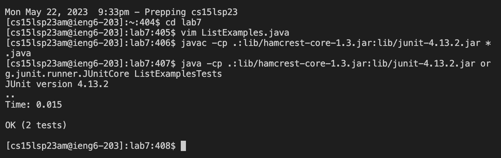
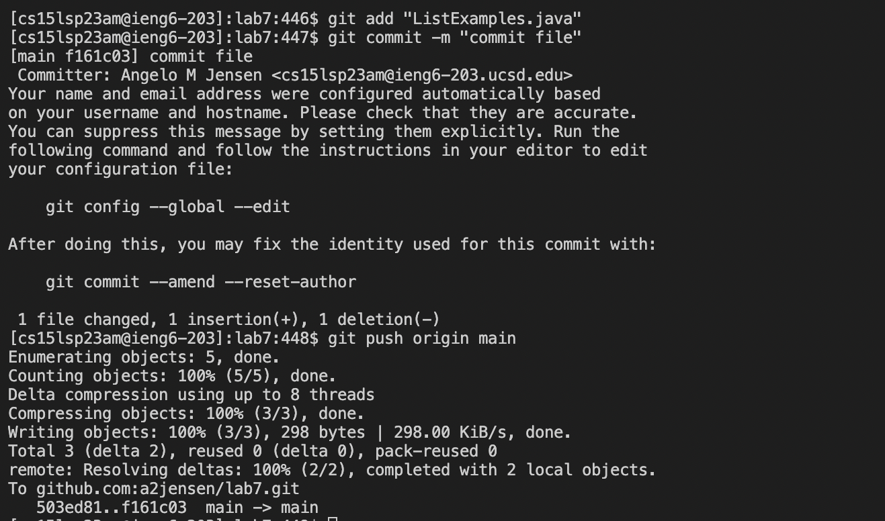

## Lab Report 4
# Step 4: Logging in through ieng6

With this step, I opened the terminal and logged into my ieng6 account.

**Keys pressed:**

ssh cs15lsp23am@ieng6.ucsd.edu, ```<enter>```


  
# Step 5: Clone your fork of the repository

With this step, I cloned the repository by using command ``` git clone ```. (For me, I already cloned it)
  
**Keys pressed:**
  
git clone git@github.com:a2jensen/lab7.git, ```<enter>```


  
# Step 6: Run tests demonstrating they fail
  
With this step, I compiled and executed the files but I got the error ```testMerge2```
  
**Keys pressed:**

```javac -cp .:lib/hamcrest-core-1.3.jar:lib/junit-4.13.2.jar *.java, then <enter>```
```java -cp .:lib/hamcrest-core-1.3.jar:lib/junit-4.13.2.jar org.junit.runner.JUnitCore ListExamplesTests, then <enter>```



# Step 7: Fix the failing test
  
With this step, I fixed the error on ListExamples.java by using vim. The error was to change ```index1``` to ```index2``` in ```result.add(list2.get(index2))```


  
**Keys pressed:**

vim ListExamples.java, then <enter>

```<j>, <j>, <j>, <j>, <j>, <j>, <j>, <j>, <j>, <j>, <j>, <j>, <j>, <j>, <j>, <j>, <j>, <j>, <j>, <j>, <j>, <l>, <l>, <l>, <l>, <l>, <l>, <l>, <l>, <l>, <l>, <l>, <l>, <l>, <r>, <2>, <esc>, <:>, wq <enter>```
  
# Step 8: Run the tests showing that they succeed

With this step, I used commands ```javac -cp .:lib/hamcrest-core-1.3.jar:lib/junit-4.13.2.jar *.java``` and ```java -cp .:lib/hamcrest-core-1.3.jar:lib/junit-4.13.2.jar org.junit.runner.JUnitCore ListExamplesTests``` to execute ListExamplesTests.
  


**Keys pressed:**
  
```<up>, <up>, <enter>, java -cp .:lib/hamcrest-core-1.3.jar:lib/junit-4.13.2.jar org.junit.runner.JUnitCore ListExamplesTests, <enter>```
  
  
# Step 9: Commit and push resulting change to personal Github account
  
With this step, I add ListExamples.java by using the ```git add``` command. I then git commit the file. I use ```git push origin main``` to push changes.
  
**Keys pressed:**
  
git add "ListExamples.java", then ```<enter>```,
git commit -m “commit file”, then ```<enter>```,
git push origin main, then ```<enter>```


